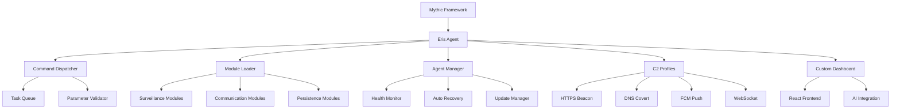

# Eris Android Agent

<p align="center">
  
</p>

<p align="center">
  <strong>Advanced Android Command & Control Agent for Mythic Framework</strong>
</p>

<p align="center">
  
  
  
  
  
</p>

---

## 🌟 Overview

**Eris** is a comprehensive Android Command & Control platform designed for advanced persistence, surveillance, and data exfiltration capabilities. Built specifically for the [Mythic 3.3 Framework](https://github.com/its-a-feature/Mythic), Eris provides sophisticated Android exploitation capabilities with support for Android 12-16 (API levels 31-36) and advanced anti-detection features.

### 🎯 Key Features

- **🔒 Advanced Persistence**: Multiple persistence mechanisms with stealth techniques
- **📱 Modern Android Support**: Full compatibility with Android 12-16 including latest security bypasses
- **🕵️ Comprehensive Surveillance**: Camera, microphone, location, keylogging, and screen capture
- **📡 Multi-Profile C2**: HTTP(S), DNS covert channels, FCM push notifications, and WebSocket
- **🛡️ Anti-Detection**: Anti-forensics, sandbox evasion, and dynamic analysis prevention
- **🎛️ Custom Dashboard**: Real-time web-based C2 dashboard with AI-powered command suggestions
- **🔧 Modular Architecture**: Extensible plugin system with dependency injection
- **💾 Offline Operations**: Comprehensive offline logging and data synchronization

---

## 🚀 Quick Start

### Prerequisites

- **Kali Linux** (recommended) or compatible Linux distribution
- **Docker** and **Docker Compose**
- **Python 3.11+**
- **Mythic Framework 3.3+**

### One-Click Installation (Kali Linux)

```bash
# Download and run the automated setup script
wget https://raw.githubusercontent.com/yourusername/eris-android-agent/main/setup_kali_mythic.sh
chmod +x setup_kali_mythic.sh
./setup_kali_mythic.sh
```

The setup script will automatically:
- Install Mythic Framework 3.3
- Configure Docker environment
- Install Android SDK and build tools
- Deploy Eris agent and C2 profiles
- Setup the custom dashboard
- Configure firewall and systemd services

### Manual Installation

<details>
<summary>Click to expand manual installation steps</summary>

#### 1. Install Mythic Framework

```bash
# Install Mythic CLI
sudo curl -L "https://github.com/its-a-feature/Mythic/releases/latest/download/mythic-cli-linux-amd64" -o /usr/local/bin/mythic-cli
sudo chmod +x /usr/local/bin/mythic-cli

# Create Mythic directory
sudo mkdir -p /opt/mythic
sudo chown $USER:$USER /opt/mythic
cd /opt/mythic

# Initialize Mythic
git clone https://github.com/its-a-feature/Mythic.git .
./mythic-cli install github https://github.com/MythicC2Profiles/http.git
```

#### 2. Install Eris Agent

```bash
# Clone Eris repository
cd /opt/mythic/Agents
git clone https://github.com/yourusername/eris-android-agent.git eris
cd eris

# Install Python dependencies
python3 -m venv venv
source venv/bin/activate
pip install -r requirements.txt

# Install Android build tools
./install_android_tools.sh
```

#### 3. Configure Mythic Integration

```bash
# Install Eris in Mythic
cd /opt/mythic
./mythic-cli install folder /opt/mythic/Agents/eris

# Start Mythic
./mythic-cli build
./mythic-cli start
```

</details>

---

## 🎛️ Custom C2 Dashboard

Eris includes a sophisticated web-based dashboard built with modern technologies for enhanced operator experience:

### 🖥️ Dashboard Features

- **Real-time Device Management**: Live device status, location tracking, and health monitoring
- **Interactive Terminal**: Full shell access with command history and autocomplete
- **File Explorer**: Browse, upload, download files with drag-and-drop support
- **Surveillance Controls**: Camera, microphone, and screen capture with live preview
- **Communication Access**: SMS, call logs, and contact management
- **AI Command Suggestions**: Intelligent command recommendations powered by Genkit
- **Campaign Management**: Multi-campaign isolation with device fingerprinting

### 🛠️ Dashboard Technology Stack

- **Frontend**: Next.js 14 with TypeScript and React
- **Styling**: Tailwind CSS with custom Eris theme
- **Components**: shadcn/ui component library
- **Real-time Updates**: WebSocket connections for live data
- **Authentication**: JWT-based secure authentication

### 📱 Dashboard Screenshots

<p align="center">
  
  
</p>

<p align="center">
  
  
</p>

---

## 🏗️ Architecture

### 🧩 Core Components



### 📦 Module System

Eris uses a sophisticated module loading system with dependency injection:

- **📷 Surveillance Modules**: Camera, microphone, screen capture, keylogging
- **💬 Communication Modules**: SMS, call logs, contacts extraction
- **🔍 Information Gathering**: Device info, installed apps, network configuration
- **🎯 Persistence Modules**: Multiple persistence techniques and stealth mechanisms
- **🔧 System Modules**: File operations, shell access, process management

---

## 🛡️ Security Features

### 🔒 Anti-Detection Capabilities

- **Dynamic Analysis Evasion**: Frida detection, debugger detection, emulator detection
- **Static Analysis Resistance**: Code obfuscation, string encryption, control flow obfuscation
- **Behavioral Stealth**: Legitimate app mimicking, user interaction simulation
- **Anti-Forensics**: Secure deletion, log sanitization, artifact cleanup

### 🎭 Persistence Mechanisms

- **Device Administrator**: Silent installation with admin privileges
- **Accessibility Service**: UI automation and accessibility-based persistence
- **System Integration**: Deep system hooks and service integration
- **Boot Persistence**: Multiple boot receiver methods with priority handling

### 🔐 Encryption & Security

- **AES-256-GCM**: All communications encrypted with military-grade encryption
- **Campaign Isolation**: Device fingerprinting prevents cross-campaign contamination
- **Certificate Pinning**: Prevents man-in-the-middle attacks
- **Anti-Tampering**: Runtime application self-protection (RASP) techniques

---

## 🎯 Capabilities

### 📡 Command & Control

| Category | Commands | Description |
|----------|----------|-------------|
| **File Operations** | `download`, `upload`, `ls`, `cat`, `rm`, `mkdir` | Comprehensive file system access |
| **System Operations** | `shell`, `ps`, `kill`, `whoami`, `id` | System administration and process control |
| **Surveillance** | `screenshot`, `camera`, `microphone`, `location` | Real-time surveillance capabilities |
| **Communications** | `sms`, `call_log`, `contacts` | Access to communication data |
| **Advanced** | `frida`, `overlay`, `keylog` | Advanced exploitation techniques |

### 🌐 C2 Profiles

#### 1. HTTPS Beacon
- Malleable HTTP profiles
- Domain fronting support
- User-agent rotation
- Traffic blending

#### 2. DNS Covert Channel
- DNS over HTTPS (DoH)
- DNS over TLS (DoT)
- Data exfiltration via DNS queries
- Steganographic encoding

#### 3. FCM Push Notifications
- Firebase Cloud Messaging integration
- Wake-on-demand capabilities
- Battery optimization bypass
- Real-time command delivery

#### 4. WebSocket
- Persistent connections
- Real-time bidirectional communication
- Low-latency operations
- Heartbeat mechanisms

---

## 🔧 Configuration

### 📋 Payload Configuration

Eris supports extensive configuration options through the Mythic web interface:

```json
{
  "target_android_version": "14",
  "enable_device_fingerprinting": true,
  "thread_pool_size": 5,
  "c2_profile": "https_beacon",
  "encryption_algorithm": "AES-256-GCM",
  "stealth_persistence_method": "accessibility_service",
  "anti_forensics_level": "high",
  "sandbox_evasion_techniques": ["frida_detection", "emulator_detection"],
  "module_load_order": ["stealth_surveillance", "communication", "persistence"],
  "android_14_privacy_bypass": true,
  "enable_offline_logging": true,
  "logging_interval": 300
}
```

### 🎛️ Dashboard Configuration

The dashboard can be customized through environment variables:

```bash
# Dashboard Configuration
ERIS_DASHBOARD_PORT=3000
ERIS_API_ENDPOINT=https://your-mythic-server.com
ERIS_WEBSOCKET_ENDPOINT=wss://your-mythic-server.com/ws
ERIS_AI_ENABLED=true
GENKIT_API_KEY=your-genkit-api-key
```

---

## 🧪 Testing

### Unit Tests

```bash
# Run all tests
cd /opt/mythic/Agents/eris
python -m pytest test/ -v

# Run specific test categories
python -m pytest test/unit/ -v        # Unit tests
python -m pytest test/integration/ -v # Integration tests
```

### Integration Testing

```bash
# Test C2 profiles
python -m pytest test/integration/test_c2_integration.py -v

# Test APK building
python -m pytest test/integration/test_apk_injection.py -v

# Test agent manager
python -m pytest test/unit/test_agent_manager.py -v
```

---

## 📚 Documentation

### 📖 Available Documentation

- **[Setup Documentation](SETUP_DOCUMENTATION.md)** - Detailed installation and configuration guide
- **[Mythic Integration](MYTHIC_INTEGRATION_README.md)** - Framework integration details
- **[Operator Manual](docs/operator_manual.md)** - Complete operator guide
- **[OPSEC Guide](docs/opsec_guide.md)** - Operational security considerations
- **[Deployment Guide](docs/deployment_guide.md)** - Production deployment instructions
- **[C2 Profiles](c2_profiles/README.md)** - C2 profile documentation
- **[Dashboard Guide](mythic_android_dashboard/README.md)** - Custom dashboard documentation

### 🎓 Training Resources

- **Video Tutorials**: Step-by-step installation and usage guides
- **Operator Playbooks**: Real-world scenario walkthroughs  
- **API Documentation**: Complete API reference for custom integrations
- **Plugin Development**: Guide for creating custom modules

---

## 🤝 Contributing

We welcome contributions to the Eris project! Please read our [Contributing Guidelines](CONTRIBUTING.md) before submitting pull requests.

### 🛣️ Development Roadmap

- [ ] **Android 15/16 Support**: Enhanced support for latest Android versions
- [ ] **iOS Agent**: Cross-platform agent development
- [ ] **Machine Learning**: Advanced AI-powered features
- [ ] **Cloud Integration**: AWS/Azure deployment options
- [ ] **Mobile MDM**: Enterprise mobile device management features

### 🐛 Bug Reports

Please use the [GitHub Issues](https://github.com/yourusername/eris-android-agent/issues) page to report bugs or request features.

---

## ⚖️ Legal & Ethics

### 🚨 Important Legal Notice

**Eris is designed for legitimate security research, penetration testing, and authorized security assessments only.**

By using this software, you agree to:

- ✅ Use only on systems you own or have explicit written permission to test
- ✅ Comply with all applicable local, state, and federal laws
- ✅ Follow responsible disclosure practices
- ✅ Not use for malicious or illegal activities

### 🎯 Intended Use Cases

- **Red Team Assessments**: Authorized penetration testing
- **Security Research**: Academic and professional research
- **Vulnerability Assessment**: Enterprise security testing  
- **Training & Education**: Cybersecurity education programs

---

## 📄 License

This project is licensed under the MIT License - see the [LICENSE](LICENSE) file for details.

---

## 🙏 Acknowledgments

- **Mythic Framework Team** - For creating the excellent C2 framework
- **Android Security Research Community** - For ongoing research and techniques
- **Open Source Contributors** - For tools and libraries that make this possible

---

## 📞 Support & Contact

- **GitHub Issues**: [Report Bugs & Feature Requests](https://github.com/yourusername/eris-android-agent/issues)
- **Documentation**: [Complete Documentation Hub](https://eris-docs.example.com)
- **Community**: [Discord Server](https://discord.gg/eris-android)
- **Professional Support**: [enterprise@eris-agent.com](mailto:enterprise@eris-agent.com)

---

<p align="center">
  <strong>🎯 Happy Hunting with Eris! 🎯</strong>
</p>

<p align="center">
  
</p>
