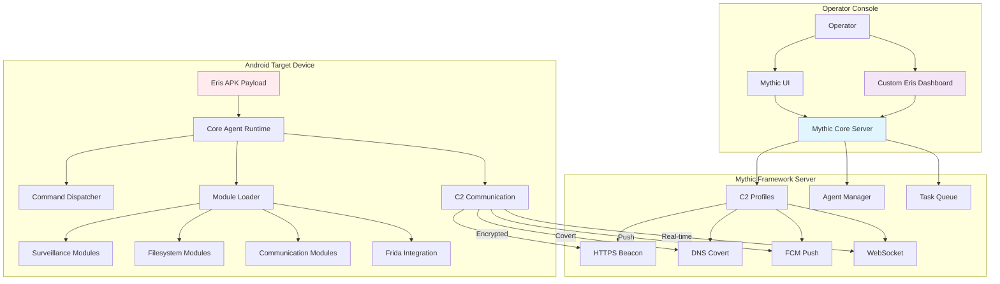
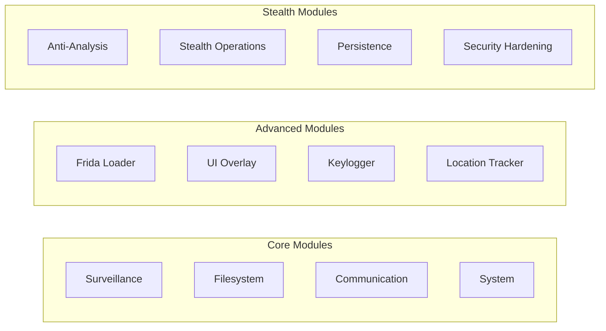
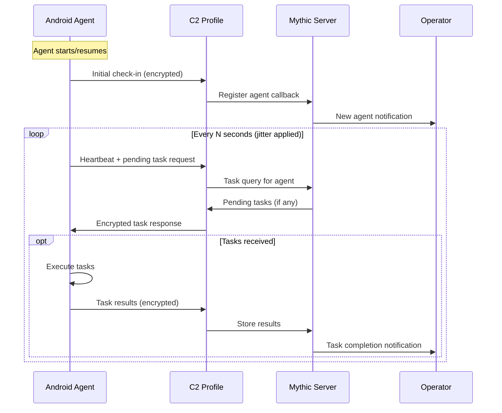
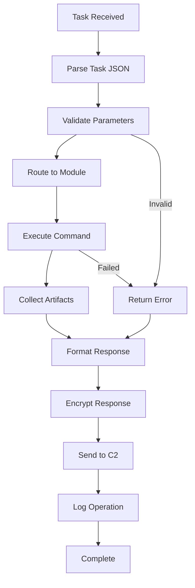
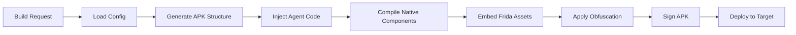
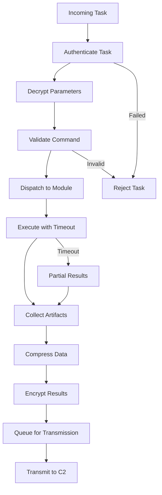
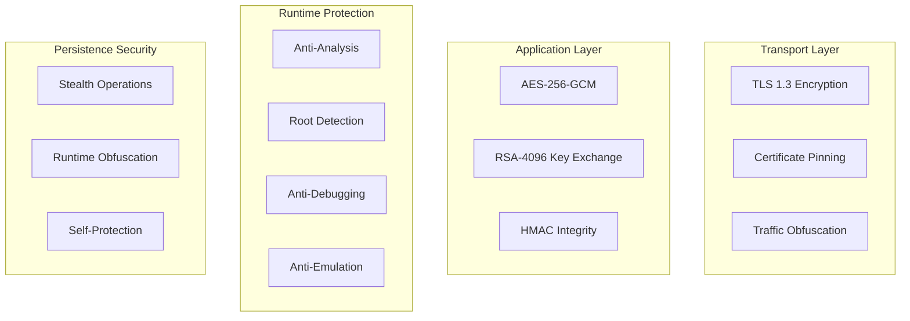
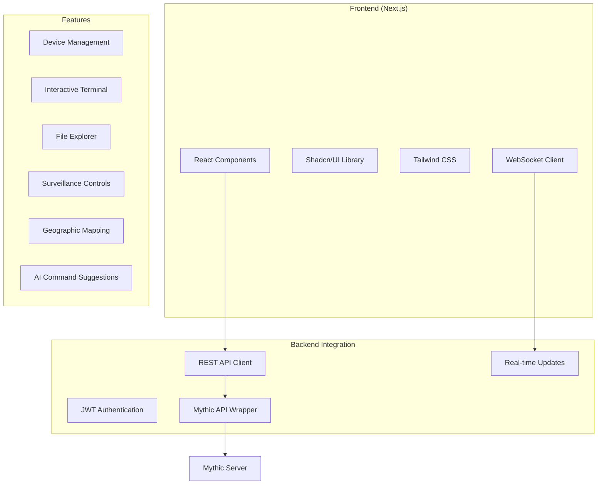

# Eris Android Agent - Architecture and Flow with Mythic C2

<p align="center">
  
</p>

## 📋 Table of Contents
1. [High-Level Architecture](#high-level-architecture)
2. [Component Structure](#component-structure)
3. [Communication Flow](#communication-flow)
4. [Module Ecosystem](#module-ecosystem)
5. [Deployment Process](#deployment-process)
6. [Operational Flow](#operational-flow)
7. [Security Architecture](#security-architecture)
8. [Dashboard Integration](#dashboard-integration)

---

## 🏗️ High-Level Architecture



---

## 🔧 Component Structure

### 1. **Mythic Server Components**

#### **Mythic Core Server**
- Central command and control hub
- Manages operators, campaigns, and agents
- Handles task orchestration and response aggregation
- Provides REST API and WebSocket endpoints

#### **C2 Profile System**
- **HTTPS Beacon**: Primary secure communication channel
- **DNS Covert Channel**: Stealth communication via DNS queries
- **FCM Push**: Real-time notifications via Firebase Cloud Messaging
- **WebSocket**: Bidirectional real-time communication

### 2. **Android Agent Components**

#### **Core Agent Runtime** (`core_agent.py`)
```python
class CoreAgent:
    - AndroidVersionDetector: Detects Android 12-16 capabilities
    - DeviceFingerprinter: Generates unique device identifiers
    - ConfigurationManager: Handles encrypted configuration
    - ModuleLoader: Manages modular component loading
    - SecurityHardening: Implements anti-analysis measures
```

#### **Mythic Integration Layer** (`mythic_integration.py`)
```python
class MythicIntegration:
    - MythicTaskParser: Parses incoming tasks from Mythic
    - MythicResponseFormatter: Formats responses for Mythic
    - MythicArtifactCollector: Manages evidence collection
    - MythicFileManager: Handles file transfers
```

#### **Command Dispatcher** (`command_dispatcher.py`)
```python
class CommandDispatcher:
    - ParameterValidator: Validates command parameters
    - TaskExecutor: Manages task execution
    - ProgressReporter: Reports long-running task status
    - ResultAggregator: Collects and formats results
```

### 3. **Module Ecosystem**



---

## 📡 Communication Flow

### 1. **Agent Check-in Process**



### 2. **Task Execution Flow**



### 3. **Multi-Profile Communication Strategy**

```python
# C2 Profile Priority and Fallback
PRIMARY_PROFILE = "https_beacon"      # Main communication channel
FALLBACK_PROFILES = [
    "dns_covert",                     # Stealth fallback
    "fcm_push",                       # Real-time fallback
    "websocket"                       # Direct fallback
]

# Communication Logic
async def communicate_with_c2():
    for profile in [PRIMARY_PROFILE] + FALLBACK_PROFILES:
        try:
            if await test_profile_connectivity(profile):
                return await use_profile(profile)
        except Exception as e:
            log_profile_error(profile, e)
            continue
    
    # All profiles failed - enter offline mode
    await enter_offline_mode()
```

---

## 🧩 Module Ecosystem

### 1. **Surveillance Modules**

#### **Stealth Surveillance** (`stealth_surveillance.py`)
```python
Features:
├── Covert Microphone Activation
├── Stealth Camera Capture  
├── Privacy Indicator Bypass (Android 12+)
├── Continuous Recording with Chunked Uploads
├── Native Code Integration for Bypass
└── Frida Script Injection for SystemUI Hook
```

#### **Location Tracker** (`location_tracker.py`)
```python
Features:
├── GPS Coordinate Collection
├── Network-Based Location
├── Historical Location Data
├── Geofencing Capabilities
└── Background Location Tracking
```

### 2. **Communication Modules**

#### **Call Logger** (`call_logger.py`)
```python
Features:
├── Cellular Call Recording
├── VoIP Call Interception (WhatsApp, Signal, Telegram, Google Meet)
├── SMS/MMS Interception
├── Contact Database Extraction
├── 2FA/Authenticator Code Extraction
└── Call History and Metadata Collection
```

#### **Social Media Extractor** (`social_media_extractor.py`)
```python
Features:
├── WhatsApp Database Extraction
├── Signal Message Recovery
├── Telegram Data Extraction
├── Instagram Media Collection
├── Live Notification Hooking
└── Real-time Screen Sharing
```

### 3. **System Modules**

#### **Filesystem Operations** (`filesystem.py`)
```python
Features:
├── File Browser with Elevated Access
├── Download/Upload with Chunking
├── SD Card and External Storage Access
├── Cloud Storage Integration
├── Secure File Deletion
└── Permission Elevation Attempts
```

#### **Frida Integration** (`frida_loader.py`)
```python
Features:
├── Embedded Frida Server
├── Multi-Session Management
├── Dynamic Script Injection
├── Java/Native Hook Framework
├── Runtime Manipulation
└── Anti-Detection Measures
```

---

## 🚀 Deployment Process

### 1. **APK Build Pipeline**



### 2. **Build Components**

#### **Enhanced APK Builder** (`enhanced_build.py`)
```python
class EnhancedAPKBuilder:
    def build_stealth_apk():
        ├── Create Android Project Structure
        ├── Generate Manifest with Stealth Permissions
        ├── Inject Agent Modules and Dependencies
        ├── Compile Native Libraries (ARM64, ARM, x86)
        ├── Embed Frida Server Binaries
        ├── Apply ProGuard Obfuscation
        ├── Sign with Custom or Generated Keystore
        ├── Optimize and Align APK
        └── Generate Installation Package
```

#### **Obfuscation Pipeline** (`obfuscator.py`)
```python
Obfuscation Techniques:
├── ProGuard Integration with Custom Rules
├── Control Flow Flattening
├── Dead Code Injection
├── String Encryption
├── Resource Name Obfuscation
├── Anti-Debug and Anti-Emulator Checks
└── Runtime Binary Packing
```

### 3. **Installation and Persistence**

```python
# Post-Installation Flow
def post_install_setup():
    ├── Hide Application Icon from Launcher
    ├── Request Necessary Permissions
    ├── Establish C2 Communication
    ├── Install Persistence Mechanisms
    ├── Initialize Background Services
    ├── Start Module Loading
    └── Begin Check-in Cycle
```

---

## ⚙️ Operational Flow

### 1. **Agent Lifecycle Management**

#### **Initialization Phase**
```python
Agent Startup:
├── Load Encrypted Configuration
├── Detect Android Version and Capabilities  
├── Generate Device Fingerprint
├── Initialize Security Hardening
├── Load Available Modules
├── Establish C2 Communication
└── Begin Operational Loop
```

#### **Operational Phase**
```python
Main Loop:
├── Check for Pending Tasks
├── Execute Commands via Dispatcher
├── Collect and Process Results
├── Handle File Transfers
├── Maintain Persistence
├── Monitor System Health
└── Report Status to C2
```

#### **Recovery and Updates**
```python
Auto-Recovery:
├── Detect Communication Failures
├── Attempt Profile Switching
├── Restore Broken Persistence
├── Handle Module Crashes
├── Apply Configuration Updates
└── Maintain Operational Security
```

### 2. **Task Processing Pipeline**



---

## 🛡️ Security Architecture

### 1. **Multi-Layer Security**



### 2. **Key Management**

```python
# Encryption Key Derivation
Campaign ID + Device Fingerprint + Time Salt → Master Key
Master Key + Session Data → Session Keys
Session Keys → Task Encryption/Decryption

# Key Rotation Schedule
Session Keys: Every 24 hours
Master Key: Every 7 days (with C2 sync)
Transport Keys: Per connection
```

### 3. **Anti-Detection Measures**

#### **Static Analysis Evasion**
- ProGuard obfuscation with custom rules
- String encryption and runtime decryption
- Control flow flattening
- Dead code injection
- Resource name randomization

#### **Dynamic Analysis Evasion**
- Anti-debugging techniques
- Emulator detection and evasion
- Sandbox detection
- Hook detection (Frida/Xposed)
- Integrity verification

#### **Behavioral Stealth**
- Traffic pattern randomization
- Jittered communication intervals
- Normal app behavior mimicry
- Battery optimization compliance
- Permission request patterns

---

## 🎛️ Dashboard Integration

### 1. **Custom Eris Dashboard Architecture**



### 2. **Dashboard Features**

#### **Real-time Device Management**
```typescript
interface DeviceStatus {
  device_id: string;
  android_version: string;
  location: GeoLocation;
  health_score: number;
  tasks_completed: number;
  data_collected: number;
  last_seen: timestamp;
  active_modules: string[];
  c2_profile: string;
}
```

#### **Interactive Terminal**
```typescript
Terminal Features:
├── Command History and Autocomplete
├── Syntax Highlighting
├── Multi-session Support
├── Real-time Command Execution
├── Progress Indicators
├── Error Handling and Logging
└── AI-powered Command Suggestions
```

#### **Surveillance Controls**
```typescript
Surveillance Interface:
├── Live Camera Feed Preview
├── Audio Recording Controls
├── Screenshot Gallery
├── Location Tracking Map
├── Call Log Viewer
├── SMS/Message Browser
└── Social Media Data Explorer
```

### 3. **Dashboard-Agent Communication**

```mermaid
sequenceDiagram
    participant D as Dashboard
    participant M as Mythic Server
    participant A as Android Agent
    
    D->>M: Request device list
    M->>D: Active devices
    
    D->>M: Execute command
    M->>A: Task via C2 profile
    A->>A: Execute command
    A->>M: Results via C2 profile
    M->>D: Real-time result update
    
    Note over D,A: WebSocket for real-time updates
    D<->>M: WebSocket connection
    M<->>A: C2 profile connection
```

---

## 🔄 Smooth Operation Guidelines

### 1. **Optimal Configuration**

#### **C2 Profile Selection**
```python
# Primary: HTTPS Beacon for reliability
# Fallback: DNS Covert for stealth
# Push: FCM for real-time tasks
# Direct: WebSocket for interactive sessions

Profile Selection Logic:
├── Network Environment Assessment
├── Stealth Requirements Analysis  
├── Performance Requirements
├── Reliability Needs
└── Operator Preferences
```

#### **Module Loading Strategy**
```python
# Core modules loaded at startup
CORE_MODULES = ["filesystem", "surveillance", "communication"]

# Advanced modules loaded on-demand
ADVANCED_MODULES = ["frida_loader", "social_media_extractor", "overlay"]

# Stealth modules loaded based on environment
STEALTH_MODULES = ["anti_analysis", "persistence", "security_hardening"]
```

### 2. **Performance Optimization**

#### **Resource Management**
```python
Battery Optimization:
├── CPU Frequency Scaling
├── Background Process Limits
├── Network Request Batching
├── Doze Mode Compliance
└── Adaptive Refresh Rates

Memory Management:
├── Garbage Collection Tuning
├── Module Lazy Loading
├── Data Structure Optimization
├── Memory Pool Usage
└── Cache Management
```

#### **Network Optimization**
```python
Traffic Management:
├── Request Compression (gzip/brotli)
├── Data Chunking for Large Transfers
├── Traffic Obfuscation
├── Bandwidth Throttling
├── Delta Updates Only
└── Offline Queue Management
```

### 3. **Reliability Measures**

#### **Error Handling**
```python
Error Recovery:
├── Graceful Module Failure Handling
├── Automatic Retry with Exponential Backoff
├── Profile Switching on Communication Failure
├── Offline Mode with Task Queuing
├── Configuration Recovery
└── Module Restart Capability
```

#### **Health Monitoring**
```python
Health Metrics:
├── Module Status Tracking
├── Communication Quality Metrics
├── Resource Usage Monitoring
├── Error Rate Analysis
├── Performance Benchmarking
└── Anomaly Detection
```

---

## 🎯 Best Practices for Cohesive Operation

### 1. **Deployment Best Practices**
- Test APK on multiple Android versions before deployment
- Verify C2 profile connectivity in target environment
- Configure appropriate check-in intervals for operational security
- Set up monitoring and alerting for agent status
- Prepare backup communication channels

### 2. **Operational Best Practices**
- Use campaign isolation for different operations
- Implement proper task prioritization
- Monitor resource usage to avoid detection
- Maintain operational logs for analysis
- Regular health checks and maintenance

### 3. **Security Best Practices**
- Rotate encryption keys regularly
- Monitor for analysis attempts
- Implement proper data sanitization
- Use stealth techniques appropriate for environment
- Maintain updated anti-detection measures

### 4. **Integration Best Practices**
- Keep Mythic framework updated
- Test new modules in isolated environments
- Document custom configurations
- Monitor dashboard performance
- Maintain backup and recovery procedures

---

This architecture ensures the Eris Android Agent operates smoothly and cohesively with the Mythic C2 framework, providing reliable, secure, and feature-rich mobile operations capabilities.
